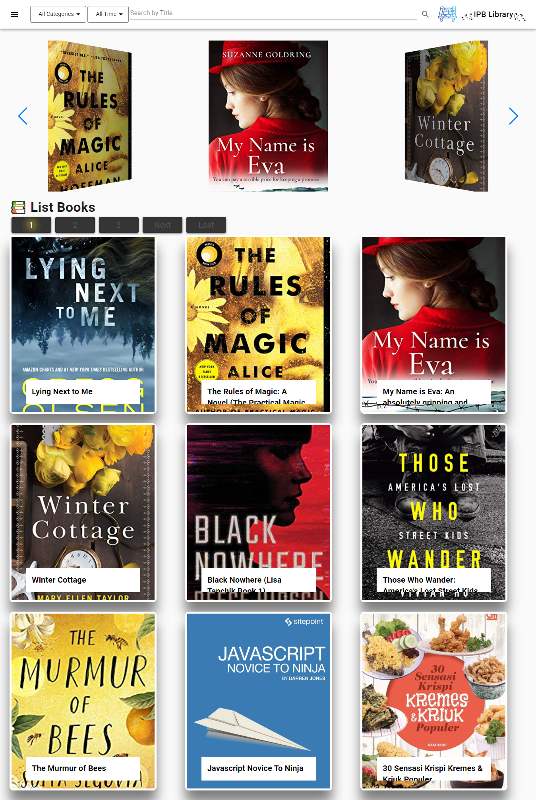
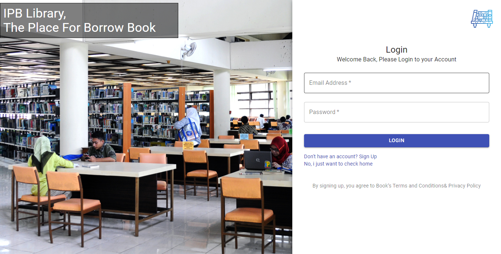
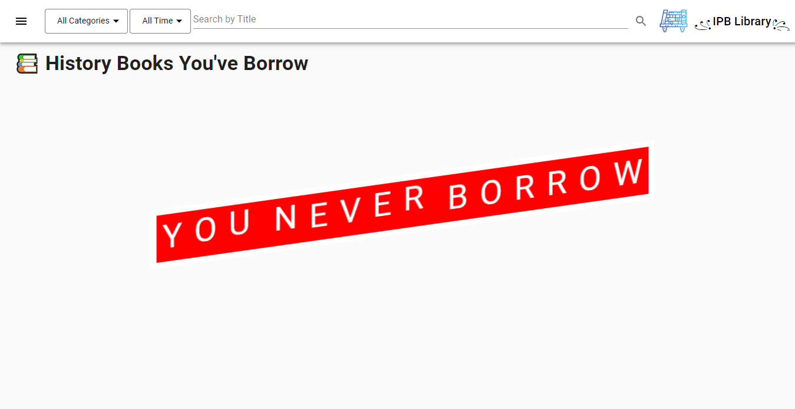
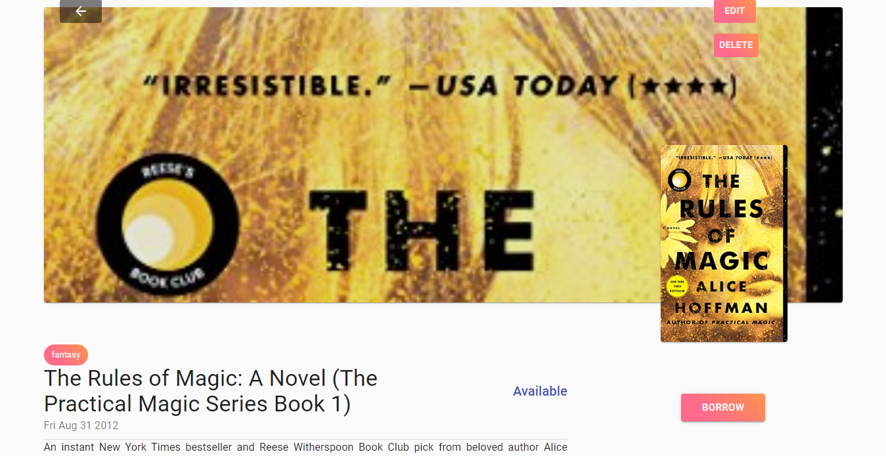

# ReactJs IPBLibrary 📚


> this app build with ReactJs and [this](https://github.com/brillianodhiya/simple-rest-library) API
> I've deploy this app, to try it at [here](https://quirky-fermat-eca999.netlify.com)

## How to run server locally

* Install and Run [this API](https://github.com/brillianodhiya/simple-rest-library) first
* Clone this Repo and install it using 
  ```sh 
  npm install 
  ```
* Go to 
  ```sh 
  src/public/action 
  ``` 
  and replace
  ```sh 
  http://https://floating-sierra-16009.herokuapp.com 
  ```
  to your IP Address
* Run this app using
   ```sh
   npm start 
   ```

## The idea behind this project

This project is made by ReactJS for frontend and Redux for management global state. This frontend made inspirated by [this figma](https://www.figma.com/file/Mj3THivoX0IaTPEZ4vJZoajw/Books?node-id=0%3A1), to bootstrap i've use [Material UI](https://material-ui.com/). But for stylig animation i just use [HTML](https://en.wikipedia.org/wiki/HTML#targetText=Hypertext%20Markup%20Language%20(HTML)%20is,scripting%20languages%20such%20as%20JavaScript.) and [CSS](https://en.wikipedia.org/wiki/Cascading_Style_Sheets)

## Screenshot Project
<kbd>




</kbd>